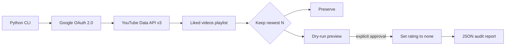

# YouTube Liked Videos Cleanup

A safety-first Python CLI that keeps the nine most recent videos in a YouTube account's **Liked videos** playlist and removes older likes in quota-aware batches.

## Project overview

Long-lived YouTube accounts can accumulate thousands of liked videos, while the official UI offers no bulk cleanup workflow. This tool uses YouTube Data API v3 and Desktop OAuth to preview the exact keep/remove split before changing the account.

The first production run audited 1,676 liked videos, preserved the newest nine, and safely stopped after 102 successful updates when the API returned a permission/limit signal.

## What this demonstrates

This project is a small but serious example of destructive automation design. The interesting part is not the API loop; it is the safety envelope around an account-wide change:

- preview before mutation;
- explicit human confirmation before execution;
- bounded batches to respect quota and reduce blast radius;
- JSON audit output for every run;
- stop-on-error behavior that preserves completed work without hiding failures.

For reviewers, the repository shows ownership of risk, practical API integration, and a preference for observable automation over blind bulk changes.

## Features

- Dry-run by default; account changes require `--execute`.
- Preserves the playlist's newest N items (`--keep 9`).
- Requires an explicit `YES` confirmation unless `--yes` is supplied.
- Supports quota-aware batches with `--max-unlike`.
- Writes a JSON audit report after every run.
- Stops on API rate/quota signals and records failures.
- Keeps OAuth secrets, tokens, and runtime reports out of Git.
- Handles Unicode video titles correctly on Windows.

## Tech stack

- Python 3.10+
- YouTube Data API v3
- Google OAuth 2.0 Desktop flow
- `google-api-python-client`
- `unittest`
- Git and GitHub
- Windows (primary), Linux/macOS compatible

## Architecture



## Folder structure

```text
YT_UnLike/
|-- config/
|   `-- private/              # ignored OAuth credentials and token
|-- docs/
|   |-- medium-article.md
|   `-- portfolio.md
|-- runtime/                  # ignored execution reports
|-- skills/
|   `-- publish-github-medium/
|-- tests/
|   `-- test_split_keep_unlike.py
|-- cleanup_liked.py
|-- requirements.txt
`-- README.md
```

## Installation

1. Enable **YouTube Data API v3** in Google Cloud Console.
2. Create a Desktop OAuth client and save its JSON as:

   `config/private/client_secret.json`

3. Create and activate a virtual environment:

```powershell
python -m venv .venv
.\.venv\Scripts\Activate.ps1
python -m pip install -r requirements.txt
```

Linux/macOS users can activate with `source .venv/bin/activate`.

## Usage

Preview without changing YouTube:

```powershell
python cleanup_liked.py --keep 9
```

Execute a conservative batch after reviewing the preview:

```powershell
python cleanup_liked.py --keep 9 --execute --max-unlike 180
```

For unattended continuation after an already-reviewed dry-run:

```powershell
python cleanup_liked.py --keep 9 --execute --yes --max-unlike 180
```

## Safety model

- Never commit `config/private/` or `runtime/*.json`.
- Always run dry-run before the first destructive batch.
- Keep batch sizes below the daily API quota.
- A deleted/private video may return 404/403; the report preserves the error.
- Revoking the app in Google Account permissions invalidates the local token.

## Tests

```powershell
python -m unittest discover -s tests -v
python -m py_compile cleanup_liked.py
```

Current suite covers keeping N, keeping all, keeping zero, and invalid negative input.

## Lessons learned

- The Liked videos playlist order is the reliable source for the newest items.
- A safe destructive tool needs preview, confirmation, bounded batches, and audit output.
- OAuth authorization and API enablement are independent Google Cloud steps.
- Windows terminal encoding must be handled explicitly for global video titles.
- API permission errors are normal operational data, not reasons to lose prior progress.

## Professional signals

The repository is designed to be readable by engineers who care about production safety. It documents the failure mode, the execution boundary, the test coverage, the secret-handling rule, and the operational result instead of presenting automation as magic.

## Future improvements

- Persistent checkpointing and retry classification.
- Automatic daily scheduling until only N items remain.
- Web UI with a visual approval queue.
- CI across Windows, Linux, and macOS.
- Structured logging and resumable job state.
- An AI agent that summarizes candidates while keeping final deletion approval human-controlled.

## Related Publication

- [How I Cleaned 1,676 YouTube Likes with Python Without Trusting Automation Blindly](https://medium.com/p/a19a81149d0d)

## License

No license has been selected yet. All rights reserved by the repository owner.
